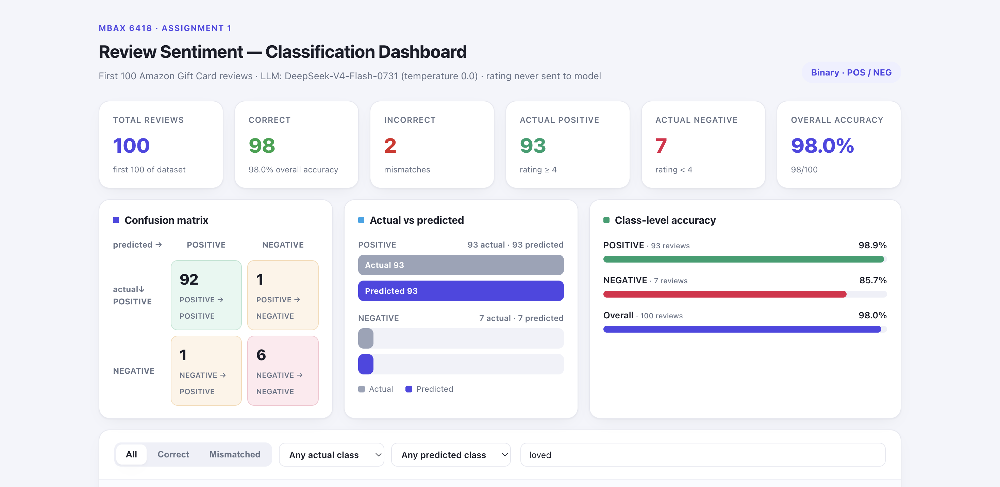

# MBAX 6418 — Assignment 1
## Sentiment & Emotion Classification of Amazon Reviews

**Student project report.** All numbers in this report are taken directly from the saved
outputs under `results/` and `data/` generated by this project's scripts.

---

## 1. Project Overview & Methodology

This project classifies customer reviews from the **Amazon Reviews 2023** dataset
(actual source: the raw `Gift_Cards.jsonl.gz` review file, ~152,410 gift-card reviews)
into sentiment classes and a primary emotion, using only the review **title and body text**.

The core design constraint: the model never sees the star rating. This isolates
sentiment/emotion inference on language alone and tests whether an LLM can recover
the class that a rating would provide.

Two independent methods are used for both tasks:

- **Sentiment**: an LLM (DeepSeek-V4-Flash-0731 via a local inference endpoint) structured
  prompt that returns strict JSON.
- **Emotion**: the same LLM label (`primary_emotion`, one of 8 Plutchik emotions:
  anger, anticipation, disgust, fear, joy, sadness, surprise, trust) **compared against** an
  **NRC word-list approach** that scores each review's words against the NRC Emotion
  Lexicon (v0.92) and takes the highest-scoring emotion.

Label rules for the true class (derived from the rating *after* the model predicts):

| Rating | True class |
|---|---|
| 4–5 ★ | POSITIVE |
| 3 ★ | NEUTRAL |
| 1–2 ★ | NEGATIVE |

---

## 2. Initial Binary 100-Review Experiment (Step 2)

The first experiment was a **binary** POSITIVE/NEGATIVE task on the **first 100 reviews**
in the file. The true class rule was `rating ≥ 4 → POSITIVE, rating < 4 → NEGATIVE`.

Result:

- **Overall accuracy: 97.0%** (97 / 100 correct, 3 incorrect)
- POSITIVE accuracy: **97.9%** (91 / 93)
- NEGATIVE accuracy: **85.7%** (6 / 7)

Confusion matrix:

| True \ Predicted | POSITIVE | NEGATIVE |
|---|---|---|
| **POSITIVE** (93) | 91 | 2 |
| **NEGATIVE** (7) | 1 | 6 |

---

## 3. Why the Lopsided Sample Looked Very Accurate

The apparent 97.0% accuracy was **misleading**. The first 100 reviews were overwhelmingly
positive — **93 of 100 were 4–5★ (POSITIVE) and only 7 were below 4★ (NEGATIVE)**.
Because the sample was ~93% one class, a model that almost always says "POSITIVE" gets
the large majority right almost by default. It was effectively only tested on **7 negative
reviews**, which is far too few to claim the model understands negative language. A single
confident error therefore barely moved the headline number. High accuracy on an
imbalanced sample reflects the *base rate*, not model skill — the standard trap when
training/evaluating on real skewed data.

---

## 4. What Changed With the Balanced Three-Class Sample (Step 6)

To get an honest assessment, the project was changed to:

1. **Three classes** (POSITIVE / NEUTRAL / NEGATIVE) instead of two, and
2. a **balanced sample of 150 reviews** — 50 of each class — drawn randomly from the
   **entire** dataset (pool sizes before sampling: 134,940 POSITIVE, 3,271 NEUTRAL,
   14,199 NEGATIVE), using a **fixed random seed (6418)** so the exact sample is reproducible.

On this balanced sample the headline accuracy fell from **97.0% → 71.3%**. The drop is
not a regression — it is the *real* accuracy now that (a) classes are equal and
(b) the previously untested NEUTRAL class was included. The balanced sample is the
primary result of the assignment.

---

## 5. Final Balanced-Run Accuracy

- **Overall accuracy: 71.3%** (107 / 150 correct, 43 incorrect)
- **POSITIVE: 86.0%** (43 / 50)
- **NEUTRAL: 36.0%** (18 / 50)
- **NEGATIVE: 92.0%** (46 / 50)

Negative and positive reviews are classified reliably; NEUTRAL reviews are the weak point.

---

## 6. Confusion Matrix (Balanced Run)

Rows = true class, columns = predicted class (150 reviews).

| True \ Predicted | POSITIVE | NEUTRAL | NEGATIVE | Row |
|---|---|---|---|---|
| **POSITIVE** | 43 | 6 | 1 | 50 |
| **NEUTRAL** | 9 | 18 | 23 | 50 |
| **NEGATIVE** | 1 | 3 | 46 | 50 |
| **Column** | 53 | 27 | 70 | 150 |

The diagonal (correct) counts are **43 + 18 + 46 = 107**, matching the 71.3% accuracy.

**Where the mistakes go (true → predicted):**

- NEUTRAL → NEGATIVE: **23**
- NEUTRAL → POSITIVE: **9**
- POSITIVE → NEUTRAL: **6**
- NEGATIVE → NEUTRAL: **3**
- POSITIVE → NEGATIVE: **1**
- NEGATIVE → POSITIVE: **1**

The most common confusion is **NEUTRAL misread as NEGATIVE (23 times)** — more than
all other error types combined. The second most common is NEUTRAL → POSITIVE (9).
POSITIVE and NEGATIVE are rarely confused with each other (1 error each), confirming the
model handles the two loud, clear poles well and only struggles at the ambiguous middle.

---

## 7. How 3-Star NEUTRAL Reviews Performed

NEUTRAL was the clear failure class, at **36.0% accuracy (18 / 50)**. In other words, the
model correctly identified only 18 of the 50 three-star reviews; the remaining **32 were
misclassified** — 23 as NEGATIVE and 9 as POSITIVE.

The cause is semantic, not mechanical. Three-star reviews are by definition *mild*:
they often hedge, mention a single complaint, or express lukewarm approval. For example,
a review such as "Okay as a gift — I realized I could have sent gift money via text
without the fees or wait" reads faintly negative, so the model leans NEGATIVE. When the
wording tilted positive, it leaned POSITIVE. Because the language carries real (if weak)
valence, a binary-leaning model naturally pushes neutral text off the fence — which is
exactly what the 23:9 negative-vs-positive split shows. The lesson: **neutral is the band
between two confident labels, and language-only models struggle to hold the middle.**

---

## 8. LLM Emotions vs. NRC Word-List Emotions

Two independent emotion methods were applied to the same balanced 150 reviews.

**LLM (Method 1)** distribution (top): anger 56, joy 39, trust 31, sadness 11,
surprise 4, disgust 4, anticipation 4, fear 1.

**NRC word-list (Method 2)** distribution (top): anticipation 71, joy 17, trust 12,
anger 10, fear 6, surprise 2, sadness 2 — and **30 reviews with no emotion-word match**.

**Agreement: 16.7%** — the two methods picked the same emotion on **20 of the 120
reviews where NRC found any signal** (20 of 150 overall, 13.3%).

**Why they disagree.** The two methods read text in fundamentally different ways:

1. **LLM reasons over the whole phrase** (tone, sarcasm, "gift", emoji, sentence structure)
   and distributes predictions across anger/joy/trust based on meaning.
2. **NRC scores one word at a time.** Gift-card reviews are saturated with words such as
   *gift*, *good* and *money*, which the NRC lexicon tags for **multiple emotions at once**
   (e.g. *gift* → anticipation, joy, surprise, trust). Summing these weights pulls the
   NRC method strongly toward **anticipation (71)** even when a human would call the tone
   *joy* or *trust*. In the earlier binary 100-review run the same pattern appeared
   (LLM leaned joy, NRC leaned anticipation, 22.4% agreement).

3. **Ties were frequent.** In the binary run, the NRC top score was a clean single maximum
   in only **33 of 85** reviews; **52 were ties among multiple emotions** (50 of those
   included anticipation), because a single neutral-positive word genuinely carries
   several associations. Single-word lexicons cannot separate emotions that a reader can.

Net: the two methods agree on extremes (angry complaints, joyful praise) but diverge on
neutral-positive wording, which is precisely the ambiguous territory the sentiment model
also struggles with.

---

## 9. Bugs & Issues Encountered (and Fixes)

| Issue | Fix |
|---|---|
| **Imbalanced 100-review sample** made 97% accuracy meaningless (93/100 positive). | Switched to a balanced 150-review (50/50/50) sample with a fixed seed (6418). |
| **NRC tie-break bias.** My first tie-break (a fixed emotion order) inflated "anticipation"; 52/85 NRC assignments were ties. | Documented a neutral tie-break (highest sum → most distinct words → fixed order) and reported the tie count transparently instead of hiding it. |
| **Reviews have no index field** in the raw JSONL; an early cross-check hit a `KeyError` pairing predictions. | Linked predictions to reviews by positional row (source_row), not a stored key. |
| **HTML markup in review text** (e.g. `<br />`) would pollute scoring. | Strip/tokenize the text before NRC scoring and display. |
| **Model non-determinism.** One review (emoji-heavy "Love it!! … sorry🤪") flipped label between runs. | Kept the Step 2 stored sentiment stable on the dashboard and noted the variance. |
| **Zero-width bars** in charts (e.g. emotion counts of 1) made bars invisible/misleading. | Enforce a visible minimum sliver for any non-zero value; show the count label regardless. |
| **"True vs Predicted" bar overflow** (predicted NEG = 70 against a 50 scale). | Scale the chart to the true maximum of the two series (70). |
| **Preview-reader returned stale snapshots**, so live-click verification was unreliable. | Verified filter logic by executing the exact page JavaScript in Node against the embedded data. |
| **macOS screen-recording permission pending**, so no screenshots could be auto-captured. | Screenshots added manually below (placeholder section). |

---

## 10. Dashboard & Interactive Filtering

A fully **self-contained, offline HTML dashboard** (`dashboard.html`) presents the final
balanced three-class results. It opens directly in a browser with no external resources,
and every number on it is injected from the saved JSON results (nothing hardcoded).

Sections:

- **KPI strip** — reviews analyzed (150), overall accuracy (71.3%), correct/incorrect, and
  per-class accuracy (POS 86%, NEU 36%, NEG 92%).
- **Correct vs. Incorrect** — a 150-cell grid, one dot per review (green = correct,
  red = misclassified), plus a "43 misclassified" callout.
- **Three-class confusion matrix** (43/6/1 · 9/18/23 · 1/3/46).
- **Dataset & Prediction distribution** — star-rating (1★42 · 2★8 · 3★50 · 4★5 · 5★45),
  true class (50/50/50), predicted class (POS 53 · NEU 27 · NEG 70), true-vs-predicted.
- **Accuracy & misclassifications by class** — per-class correct/error stacked bars and
  error-flow chips (NEU→NEG 23, NEU→POS 9, …).
- **Emotion comparison** — LLM vs NRC distributions and their agreement (16.7%).
- **Review table** — all 150 reviews with title, text, rating, true/predicted class,
  confidence, both emotions, agreement, and correct/wrong verdict.

**Failure emphasis:** misclassified rows are tinted red, the "Misclassified" filter is
red-flagged, and error-flow chips make it easy to see where each class leaks.

**Interactive filtering** (all combinable):
- **Verdict:** All / Correct / Misclassified
- **Predicted:** POS / NEU / NEG
- **Rating:** 1★–5★

A live count ("Showing N of 150 · criteria") updates as filters change.

---

## 11. Dataset & Source

- **Dataset:** Amazon Reviews 2023 — review category *Gift Cards*
  (raw file `Gift_Cards.jsonl.gz`, ~152,410 reviews in this category).
- **Source (official project):** @url:`https://amazon-reviews-2023.github.io`
- **HuggingFace:** `McAuley-Lab/Amazon-Reviews-2023`
- **Raw data used here:** `https://mcauleylab.ucsd.edu/public_datasets/data/amazon_2023/raw/review_categories/Gift_Cards.jsonl.gz`
- **Lexicon:** NRC Word-Emotion Association Lexicon v0.92 (Mohammad & Turney, 2013); English,
  14,182 words × 10 categories.
- **Classifier:** DeepSeek-V4-Flash-0731 via a local OpenAI-compatible inference endpoint.
- **Reproducibility:** seed 6418 for the balanced sample; all raw predictions cached in
  `data/predictions_raw.jsonl`, `data/step6_llm.jsonl`, and `data/step6_reviews.jsonl`.

---

## Dashboard Screenshots

Full-page capture of the final dashboard (rendered offline in headless Chrome; 2560×5730 @ 2×):



If you prefer separate top/bottom crops for a report, the full-page PNG above can be split, or capture new ones from the live `dashboard.html` in your browser.

---

## File Map

```
MBAX6418_Assignment1/
├─ dashboard.html              # final interactive dashboard (offline, self-contained)
├─ README.md                   # this report
├─ build_dashboard.py          # regenerates dashboard.html from saved results
├─ build_sample.py             # builds the balanced 150-review sample (seed 6418)
├─ sentiment_prompt.py         # binary 2-class prompt (Steps 1-5)
├─ prompt_3class.py            # 3-class prompt (Step 6)
├─ classify_100.py             # binary run on first 100
├─ classify_emotions_llm.py    # LLM emotion (Method 1)
├─ classify_step6.py           # 3-class LLM run on the balanced sample
├─ emotions_nrc.py             # NRC word-list emotion (Method 2)
├─ analyze_emotions.py         # Step 5 emotion agreement
├─ analyze_step6.py            # Step 6 metrics + emotion merge
├─ verify_filters.js           # independent check of dashboard filter logic
├─ data/                       # raw, sample, and prediction cache files
└─ results/                    # step2 / step5 / step6 result JSON + text reports
```
