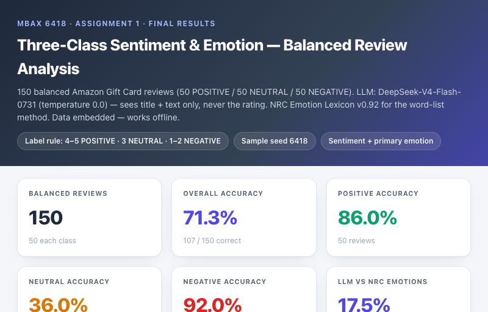

# MBAX 6418 Assignment 1
### Sentiment & Emotion Classification of Amazon Reviews

A practical machine-learning project that classifies the sentiment (and, later, the primary emotion) of Amazon product reviews using a large language model (LLM) — with a classical word-list approach as a comparison. All work is reproducible from this repository.

---

## Project Overview

The goal was to take real Amazon reviews and automatically determine **(1) the sentiment** of each review (positive/negative, and later neutral) and **(2) the primary emotion** the reviewer conveyed. We used an LLM as our main classification method because it can read a review the way a person would — understanding tone, sarcasm, and context — rather than just matching keywords.

Our approach had two key design constraints:

1. **The LLM only sees the review title and body text.** It never receives the star rating.
2. **The star rating is used only as ground truth** after the model makes its prediction, so we can measure how well the model does on its own.

We first built a simple **binary** (positive vs. negative) classifier and evaluated it on the first 100 reviews. We then upgraded the problem to **three classes** (positive / neutral / negative) and evaluated it on a **balanced sample** of 150 reviews drawn randomly from the whole dataset with a fixed random seed.

---

## Dataset

We used the **Amazon Reviews 2023** dataset published by the **McAuley Lab at UC San Diego**:

- Project site: [https://amazon-reviews-2023.github.io](https://amazon-reviews-2023.github.io)
- Data source: the **Gift Cards** review category (`Gift_Cards.jsonl.gz`, ~152,410 reviews in our copy), a gzipped JSON-lines file.

The fields we relied on were the three most meaningful for understanding a review:

| Field | What it is |
|---|---|
| `rating` | The star rating, from 1.0 to 5.0 (used **only** as ground truth) |
| `title` | The review headline written by the customer |
| `text` | The full body of the review |

We did not need the other fields (`images`, `asin`, `user_id`, timestamps, etc.) for sentiment classification. Raw review text contained HTML entities (e.g. `&#34;`) and tags like `<br />`, which we decoded and removed during preprocessing.

---

## Methodology

**LLM sentiment classification.** We used the OpenAI-compatible endpoint configured for this course, running **DeepSeek-V4-Flash-0731** at temperature **0.0** for deterministic output. Each review was sent to the model as a short prompt containing only the review `title` and `text`, and the model was asked to return a strict JSON object (`sentiment`, `primary_emotion`, `confidence`, `reason`) that Python could parse reliably.

**The model never sees the rating.** Our prompt-building code takes exactly two arguments — `title` and `text` — and the rating is never included in the message. The classifier scripts call `build_prompt(title, text)` only.

**Initial binary classification.** We began with two labels: *POSITIVE* or *NEGATIVE*. Ground truth was derived from the rating **after** prediction:

```
rating >= 4  ->  POSITIVE
rating <  4  ->  NEGATIVE
```

**LLM emotion detection.** Step by step, we also asked the model to identify the **primary emotion** of each review, drawn from a fixed set of eight (the Plutchik wheel): *anger, anticipation, disgust, fear, joy, sadness, surprise, trust*.

**NRC word-list emotion detection.** As a second, non-LLM method we scored each review with the **NRC Emotion Lexicon** (Mohammad & Turney, word-level v0.92). We tokenized the review text, matched each token against the lexicon, summed the association counts for each of the eight emotions, and selected the highest-scoring emotion as the "NRC primary emotion". Ties were broken deterministically (total score → number of distinct words → a fixed emotion order), and reviews with no lexicon matches were marked as "no match" and excluded from the agreement calculation.

**Transition to three classes.** The binary setup hid a real problem: almost all early reviews were positive, so the model looked extremely accurate partly by chance. We therefore changed the sentiment problem to three classes and redefined the ground truth:

```
rating 4-5  ->  POSITIVE
rating 3    ->  NEUTRAL
rating 1-2  ->  NEGATIVE
```

**Fixed-seed balanced sampling.** Instead of the (lopsided) first 100 reviews, we drew a **balanced sample** from the entire dataset — approximately **50 POSITIVE, 50 NEUTRAL, and 50 NEGATIVE** reviews (150 total), sampled uniformly at random within each class using the fixed random seed **6418** so the exact same sample can be reproduced every time. We did not just take the first rows.

---

## Initial Imbalanced Results

We first evaluated binary sentiment on the **first 100 reviews** in the file. These numbers are verified from `results/step2_summary.json`:

| Metric | Value |
|---|---|
| Reviews | 100 |
| Correct / incorrect | 98 / 2 |
| **Overall accuracy** | **98.0%** |
| POSITIVE accuracy | 92/93 = **98.9%** |
| NEGATIVE accuracy | 6/7 = **85.7%** |
| Actual POSITIVE / NEGATIVE | 93 / 7 |

This looked extremely good — but the sample was **highly imbalanced**: **93 of the 100 reviews were positive**. Because the model is strong at recognizing obviously positive reviews (92 of 93 correct), and there were only 7 negatives to get right, the overall accuracy of 98% is inflated by the distribution. A trivial baseline that predicted "POSITIVE" for every review would already score 93%. The high number told us less about the model's true skill than about how lopsided the data was.

---

## Balanced Three-Class Results

After balancing, we ran the three-class model on **150 reviews (50 per class)**. These numbers are verified from `results/step6_metrics.json`:

| Metric | Value |
|---|---|
| Reviews (balanced) | 150 (50 / 50 / 50) |
| Correct / incorrect | 107 / 43 |
| **Overall accuracy** | **71.3%** |
| **POSITIVE accuracy** | 43/50 = **86.0%** |
| **NEUTRAL accuracy** | 18/50 = **36.0%** |
| **NEGATIVE accuracy** | 46/50 = **92.0%** |
| Predicted into POS / NEU / NEG | 52 / 27 / 71 |

**3×3 confusion matrix** (rows = actual, columns = predicted):

| | POS | NEU | NEG |
|---|---|---|---|
| **POSITIVE** | 43 | 6 | 1 |
| **NEUTRAL** | 8 | 18 | 24 |
| **NEGATIVE** | 1 | 3 | 46 |

**What changed after balancing:** overall accuracy dropped from 98.0% to **71.3%**. This is not the model getting worse — it is the data getting more honest. Positive-only and negative-only accuracy stayed strong (86% and 92%), but with neutral reviews now making up one-third of the sample, the model's weakness at detecting neutrality was exposed and pulled the overall average down substantially.

---

## Error Analysis

The confusion matrix shows exactly where the model struggles:

- **POSITIVE reviews** were mostly classified correctly (43/50). Only 6 were called neutral and 1 was called negative.
- **NEGATIVE reviews** were classified very well (46/50), with just 1 called positive and 3 called neutral.
- **NEUTRAL reviews were the problem.** Only **18 of 50** were correctly called neutral. The model pushed **24 neutral (3-star) reviews toward NEGATIVE** and 8 toward POSITIVE.

Where 3-star reviews went:

| Actual (rating 3) | Predicted | Count |
|---|---|---|
| NEUTRAL | NEGATIVE | **24** |
| NEUTRAL | NEUTRAL | 18 |
| NEUTRAL | POSITIVE | 8 |

So **48% of true-neutral reviews were labeled negative**. The model was also quite confident while being wrong — its average confidence on NEUTRAL reviews was 0.76. In other words, the LLM tends to interpret any hint of complaint or disappointment in a three-star review as outright negative, and it does so with misplaced certainty. This is the clearest takeaway: *the model treats "neutral" as an under-served middle ground and over-slides it toward the negative class.*

---

## Emotion Analysis

We compared the **LLM's primary emotion** against the **NRC word-list emotion** on the same reviews. Agreement is low because the two methods work very differently.

**Initial run (first 100 reviews)** — verified from `results/step5_emotion_comparison.json`:
- Reviews with both an LLM and NRC emotion: **85** (15 reviews had no NRC lexicon match)
- Agreed: **19** · Disagreed: **66**
- Agreement: **22.4%** of those with both predictions (19.0% of all 100)

**Final balanced run (150 reviews)** — verified from `results/step6_metrics.json`:
- Both emotions predicted: **120** · Agreed: **21** · Disagreed: **99**
- Agreement: **17.5%** of those with both (14.0% of all 150)

**Why they differ.** The NRC method is a *bag-of-words count*: it scores each word independently, ignores context and negation, and has no notion of tone. Because gift-card reviews constantly use words like *gift*, *good*, and *money* — all of which the lexicon tags with several emotions at once — the NRC method over-assigns **anticipation**. The LLM instead reads the whole sentence and collapses most of these into **joy**.

| Review | LLM emotion | NRC emotion |
|---|---|---|
| "Great gift" | joy | anticipation |
| "Nice looking" | joy | anticipation |
| "Not $10 Gift Cards" (card had less value) | anger | joy |

On the balanced set, the LLM was most often happy/angry (joy 40, anger 52), while the NRC lexicon was heavily weighted toward anticipation (71) or returned no match (30). The two methods clearly measure emotion in fundamentally different ways — one semantic, one lexical.

---

## Dashboard

The project includes a polished, fully self-contained HTML dashboard (`dashboard_step6.html`) that works offline by opening the file directly in a browser. It is built from `data/step6_balanced_results.csv` with all numbers computed from the embedded data, so every figure matches the saved results exactly.

It shows:
- **Headline metrics:** balanced reviews, overall accuracy, accuracy per sentiment class, and LLM-vs-NRC emotion agreement
- **Visualizations:** star-rating distribution, actual and predicted sentiment distributions, actual-vs-predicted comparison, the 3×3 confusion matrix, accuracy by class, and LLM vs. NRC emotion distributions
- **An interactive review explorer** listing every review (rating, title, text, actual/predicted sentiment, correct/mismatch, LLM emotion, NRC emotion) with **live filters** for correct vs. mismatched, actual sentiment, predicted sentiment, LLM emotion, NRC emotion, and free-text search — the visible count updates instantly

A binary version (`dashboard.html`) covering the first 100 reviews is also included.

### Dashboard screenshots



---

## Problems and Lessons Learned

These are the real issues we hit while building the project and how we solved them.

**Processing the data.**
- The review text contained HTML entities and tags (`&#34;`, `<br />`). We decoded entities and stripped tags before tokenizing for the NRC method, so those artifacts didn't pollute the word matching.
- The dataset is a large gzipped JSON-lines file; we streamed through it instead of loading everything into memory at once.

**Calling the model.**
- The LLM sometimes wrapped its answer in markdown code fences or added commentary around the JSON. We wrote a tolerant parser that strips fences and extracts the JSON object, so the output stays reliably parseable.
- Running 150 model calls takes several minutes. We added resume-friendly caching so a re-run skips reviews already scored instead of re-calling the model.

**Building charts and the dashboard.**
- Bar charts for very small counts (e.g. a single review, or zero) could visually "disappear". We added a minimum bar width and always rendered the numeric count as text, so no value vanishes.
- The bar fills used `position:absolute` without a relative track, which made bars anchor to the wrong element. We fixed the CSS positioning.
- The emotion filters silently did nothing at first because of an internal field-name mismatch in the JavaScript. We fixed the mapping and verified every filter returns the correct row count against the data.

**Working with the agent/environment.**
- A `timeout` command present in the auth scripts doesn't exist on macOS, which initially broke a login step; we used the native keychain path instead.
- When a piece of reviewed code had a bad name/field mapping, the dashboard *looked* broken even though the logic was fine — we learned to reload/retest on a clean state before treating it as a bug.
- Version-control hygiene: we found the LLM API credentials were accidentally hardcoded in a helper file. We moved them to a gitignored config file / environment variables and removed them from the repository history before it went public.

**Emotion analysis specifically.**
- The NRC lexicon systematically over-assigns *anticipation* because gift-card staple words are tagged with many emotions, which is why LLM-vs-NRC agreement is low — an important caveat when interpreting the emotion results.

---

## Files

| Path | Purpose |
|---|---|
| `code/explore_data.py` | Loads and verifies the dataset, prints fields and sample reviews |
| `code/llm_client.py` | OpenAI-compatible LLM client (credentials from env / gitignored config) |
| `code/sentiment_prompt.py` | Reusable binary sentiment + emotion prompt & parser |
| `code/prompt_3class.py` | Three-class (POSITIVE/NEUTRAL/NEGATIVE) prompt & parser |
| `code/classify_review.py` | Reusable classification function + smoke test |
| `code/classify_100.py` | Binary run on the first 100 reviews → `results/step2_*` |
| `code/emotions_nrc.py` | NRC word-list emotion scoring (method 2) |
| `code/build_balanced_sample.py` | Builds the fixed-seed balanced 150-review sample |
| `code/classify_step6.py` | Three-class run on the balanced sample → CSV + metrics |
| `code/build_dashboard.py` | Builds the binary dashboard (`dashboard.html`) |
| `code/build_dashboard_step6.py` | Builds the three-class dashboard (`dashboard_step6.html`) |
| `prompts/sentiment_prompt.md` | The reusable LLM prompt (a deliverable) |
| `data/step6_balanced_results.csv` | Raw per-review results of the balanced run |
| `results/step2_summary.json` | Verified binary results |
| `results/step5_emotion_comparison.json` | Verified LLM-vs-NRC emotion agreement (initial run) |
| `results/step6_metrics.json` | Verified three-class metrics (final numbers) |
| `dashboard.html` | Binary dashboard (first 100 reviews) |
| `dashboard_step6.html` | Three-class dashboard (final results) |

---

## Reproducibility

Everything is reproducible because the sample draw and the model settings are fixed:

- **Fixed random seed** `6418` is used in `code/build_balanced_sample.py`, so re-running it always produces the same 50/50/50 sample.
- The LLM is run at **temperature 0.0**, so repeated predictions are stable.
- Raw predictions are cached, so re-running the scripts doesn't re-call the model.

To reproduce from scratch (using a Python 3.9+ environment with the dependencies installed):

```bash
# 1. Put Gift_Cards.jsonl.gz in data/
# 2. Configure model credentials (see below), then:
python code/explore_data.py                 # verify the dataset
python code/build_balanced_sample.py        # build the balanced 150-review sample
python code/classify_step6.py               # run 3-class sentiment + emotion, save CSV + metrics
python code/build_dashboard_step6.py        # generate the dashboard
```

**Credentials are not committed to the repository.** The LLM client reads them from environment variables (`LLM_BASE_URL`, `LLM_API_KEY`, `LLM_MODEL`) or from a gitignored `local_config.yaml` in the project root. Add your own credentials in one of those places — do not hardcode them into the scripts.

---

## Data Source

- **Dataset:** Amazon Reviews 2023 — *Gift Cards* category (review data), collected in 2023 by the [McAuley Lab](https://cseweb.ucsd.edu/~jmcauley/), UC San Diego.
- **Project page:** [https://amazon-reviews-2023.github.io](https://amazon-reviews-2023.github.io)
- **Paper:** Hou et al., *Amazon Reviews 2023: A Large-Scale Dataset for Reducing Scrutiny* (arXiv:2403.03952).

License and terms follow the Amazon Reviews 2023 dataset terms. All computed results in this report are derived from the saved output files in `results/` and can be cross-checked against `data/step6_balanced_results.csv`.
